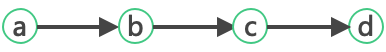
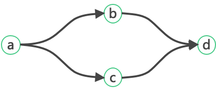
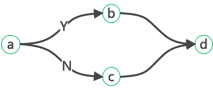
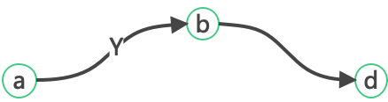
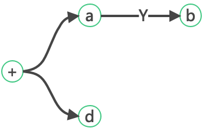
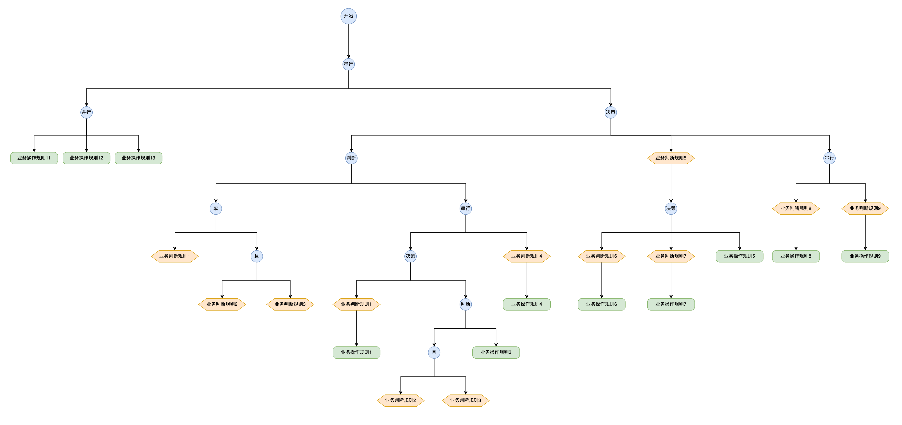

## 1. 串行执行



```text
 a->b->c->d
```

## 2. 串行执行

```text
 a->(b=>c)->d
```

## 3.条件执行

```text
 (a?b:c)->d
```

## 4.半条件执行

```text
 a?(b->d)
```

## 5.多分支执行

```text
(a?b)->d
```

## 6.UI树交互

```text
 (∅->(∅=>a11=>a12=>a13)->((c1||(c2&&c3))?(∅->(c1?a1:((c2&&c3)?a3:∅))->(c4?a4)):(c5?(c6?a6:(c7?a7:a5)):(∅->(c8?a8)->(c9?a9)))))
```
上述表达式执行逻辑如下:
```shell
 a11 &
 a12 &
 a13 &
 wait
 
 if [c1||c2&&c3];then
    if [c1];then
      a1;
    elif [c2&&c3];then
      a3;
    fi
    
    if [c4];then
      a4;
    fi
    
 elif [c5];then
    if [c6];then
      a6;
    elif [c7];then  
      a7;
    else
      a5;
    fi
    
 else
    if [c8];then
      a8;
    fi;
    
    if [c9];then
      a9;
    fi
 fi
```
注：nop不参与规则计算，仅用于反序列化UI树时区分同义表达式，存在同义表达式的情况如下：
+ CNode无action时，与ANode的规则表达式相同
+ SNode、PNode单分支时，规则表达式相同，且与ANode相同
+ DNode单分支且无action时，与CNode的规则表达式相同